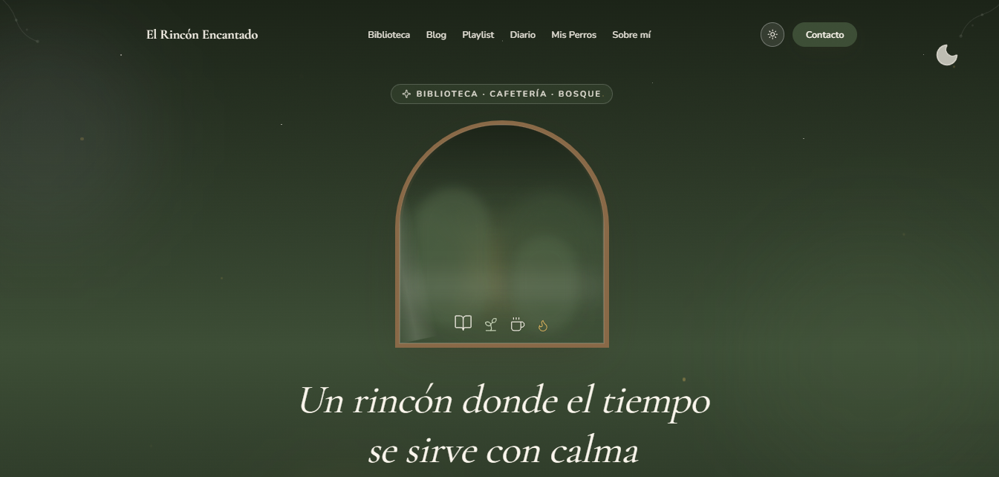
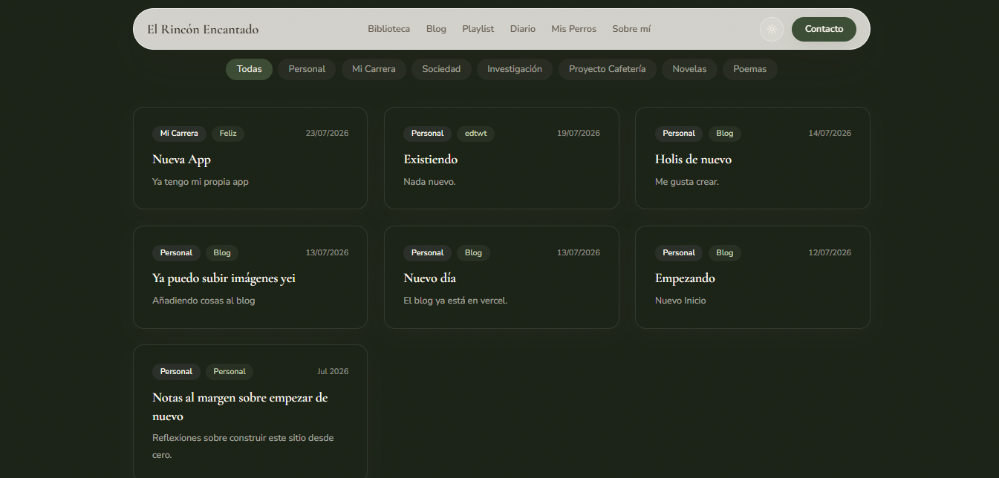
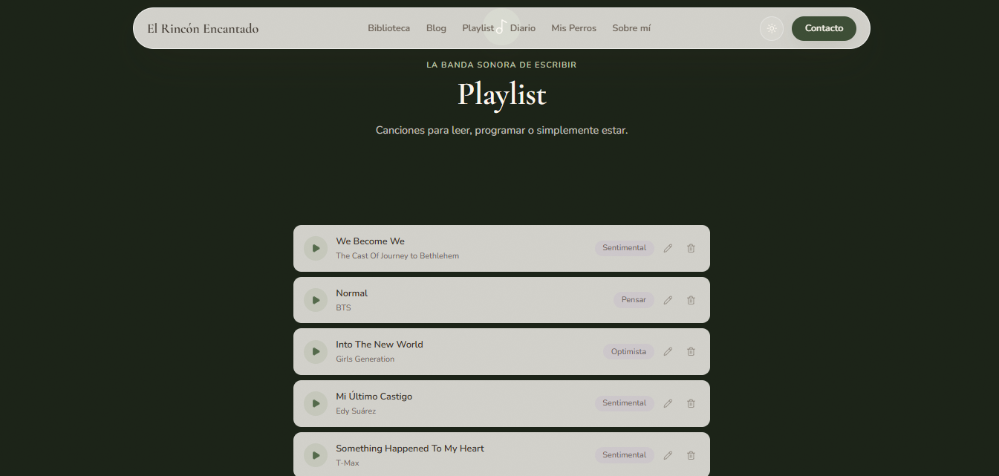

# 🌙 Rincón Encantado

Blog personal donde comparto mi proceso de aprendizaje técnico junto con mis intereses creativos — escritura, música y repostería. Un espacio propio, más allá de un portafolio puramente corporativo.

🔗 **Demo en vivo:** [hotarumori.vercel.app](https://hotarumori.vercel.app/)

## ✨ Sobre el proyecto

Quería un lugar donde publicar reflexiones sin estar limitada al formato rígido de un portafolio profesional: entradas sobre lo que voy aprendiendo como desarrolladora, pero también sobre proyectos personales y creativos que no tienen que ver directamente con código.

## 🛠️ Stack técnico

- **React** — interfaz de usuario
- **Vite** — build tool y entorno de desarrollo
- **JavaScript**
- **Supabase** — backend (base de datos y almacenamiento de las entradas del blog)

## 🚀 Funcionalidades

- Publicación y visualización de entradas de blog
- Backend real conectado a Supabase (no datos mockeados)
- Diseño responsivo

## 📸 Capturas de pantalla

### Dashboard


### Blog


### Playlist


## 📦 Instalación local

```bash
git clone https://github.com/carmenmirna-is/Blog.git
cd Blog
npm install
npm run dev
```

## 👩‍💻 Autora

**Carmen Mirna Ibañez Sanguino** — Ingeniera de Sistemas | Full Stack Developer
- [Portafolio](https://carmenmirna.vercel.app/)
- [LinkedIn](https://www.linkedin.com/in/carmen-mirna)